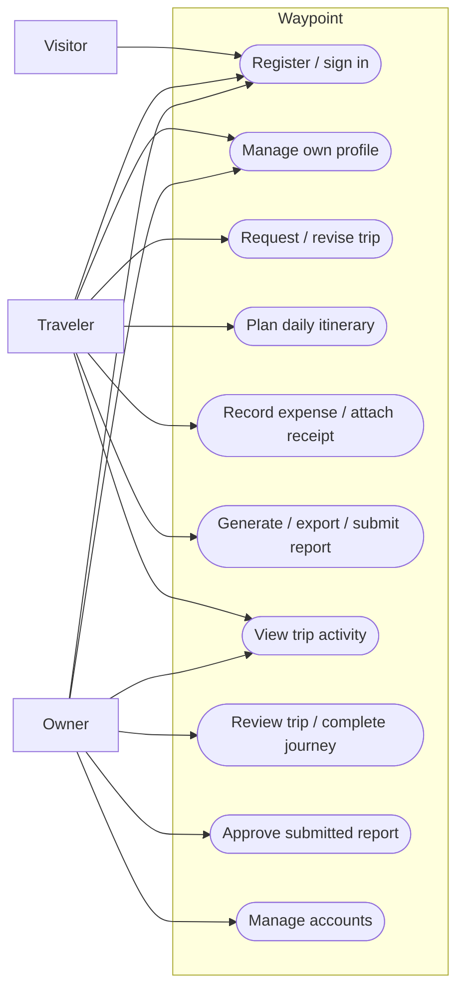
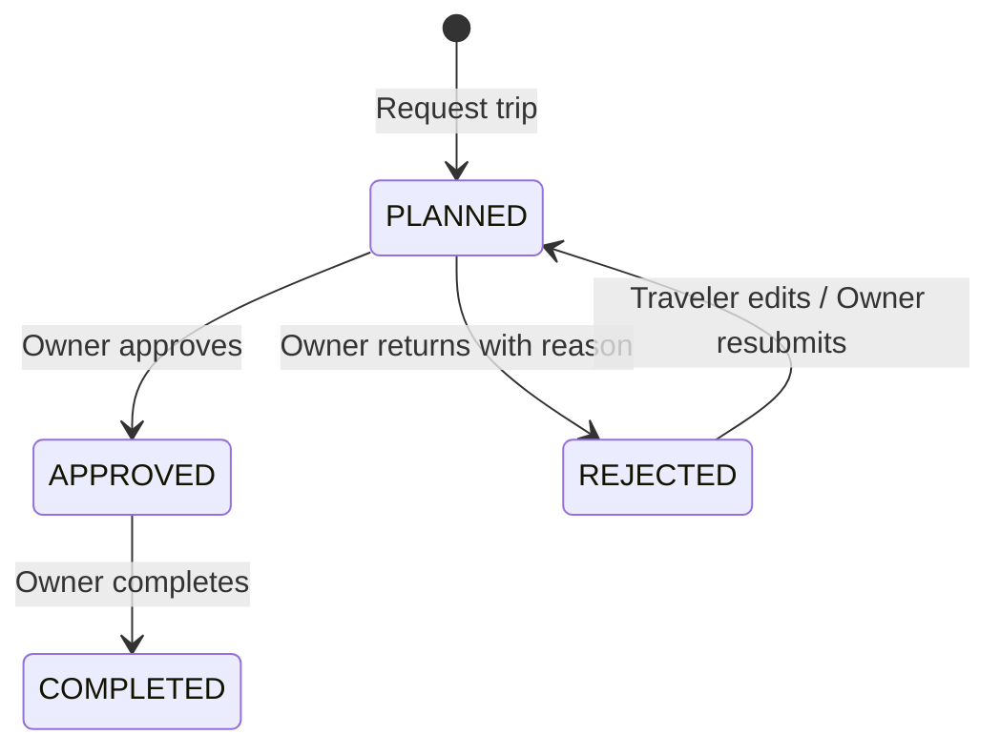
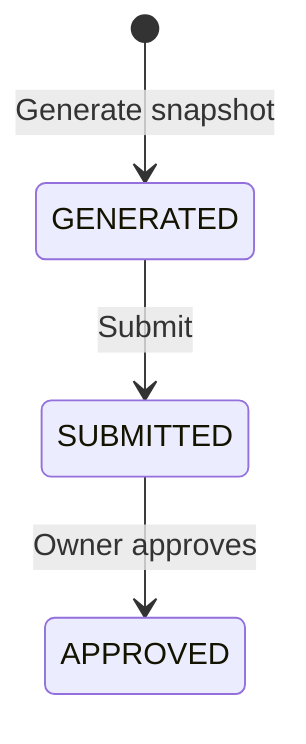
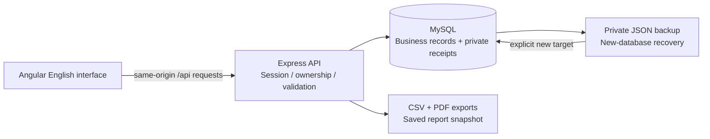
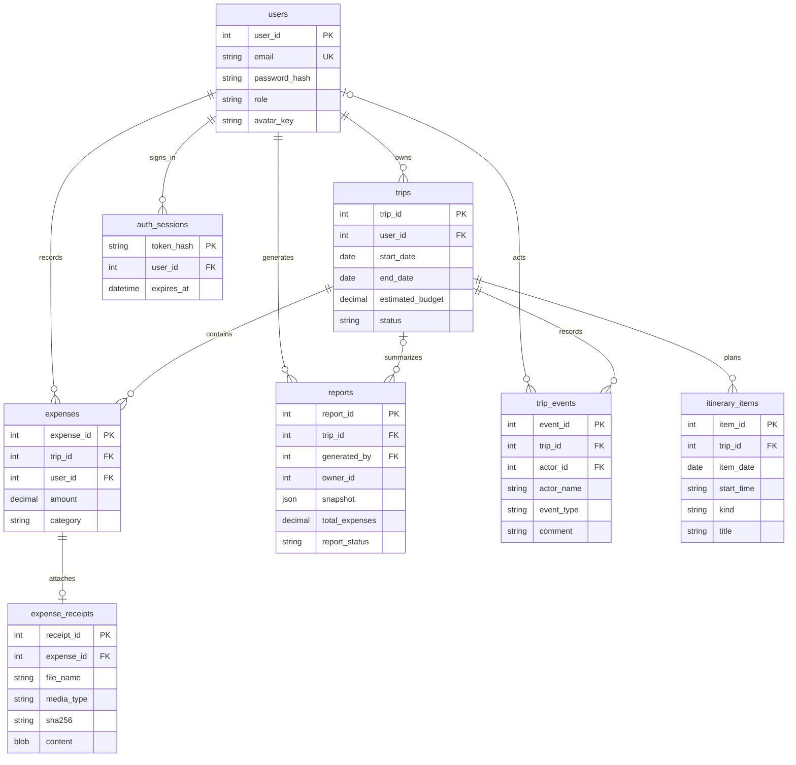

# Waypoint - Software Engineering Project

## Project scope

Waypoint is a personal extension of the TravelMS course project. It runs on one computer with Angular, Express and MySQL. Its English interface supports trip requests, daily itineraries, budget monitoring, expense evidence, review history and saved expense reports. One person can demonstrate both roles by signing in to separate Owner and Traveler sample accounts.

This document describes the implemented system. It does not claim to satisfy an unseen course rubric. The TravelMS source and applicable attribution must remain part of the submission. The personal extension was developed with Codex assistance; the presenter should be able to explain the implementation and follow the course's disclosure requirements.

## Actors and permissions

| Actor           | Capabilities                                                                                                                                                                                          |
| --------------- | ----------------------------------------------------------------------------------------------------------------------------------------------------------------------------------------------------- |
| Visitor         | Register a Traveler account and sign in. Public registration cannot choose Owner access.                                                                                                              |
| Traveler (USER) | Manage their profile, request trips, revise pending/rejected requests, plan daily items, record expenses after approval, attach receipts, generate/export/submit reports and read their trip history. |
| Owner (ADMIN)   | Review all trips, leave decisions and comments, complete approved trips, approve submitted reports and manage accounts in People.                                                                     |

The roles belong to different authenticated accounts. Demo buttons are shortcuts to sample accounts. Permission checks run on the server; hiding an interface control alone does not grant or deny access.

## Functional requirements and traceability

| ID    | Requirement                                                             | Implementation / evidence                                                                  |
| ----- | ----------------------------------------------------------------------- | ------------------------------------------------------------------------------------------ |
| FR-01 | Register and sign in with protected passwords and an expiring session.  | `backend/app.js`, authentication interface and integration tests.                          |
| FR-02 | Return to the requested authorized page after sign-in.                  | `app/shared/return-url.ts`, unit and browser tests.                                        |
| FR-03 | Travelers access only their own records; Owners can review all records. | Server session, trip/report ownership checks and cross-user API tests.                     |
| FR-04 | Create a trip with destination, dates, purpose and USD budget.          | Trips page; date/amount validation tests.                                                  |
| FR-05 | Review a pending trip and require an explanation when returning it.     | Review dialog, status transition tests and browser workflow.                               |
| FR-06 | Preserve actor, decision, comment and time in trip activity.            | `trip_events`, history integration tests. Historical events are not invented for old data. |
| FR-07 | Add/edit/remove daily activities, transport, accommodation and notes.   | Journey Itinerary; ownership, date/time and completion tests.                              |
| FR-08 | Record positive expenses in five categories within approved trip dates. | Expenses page and API tests for all categories.                                            |
| FR-09 | Attach, replace, preview, download and remove a private receipt.        | Receipt controls, PNG/JPEG/PDF validation and ownership tests.                             |
| FR-10 | Warn at 80% budget usage and show exact overrun.                        | Budget component, dashboard links, exact-cent boundary tests.                              |
| FR-11 | Save a report snapshot; later expense edits do not alter it.            | `reports.snapshot`, snapshot and CSV integration tests.                                    |
| FR-12 | Export saved reports to CSV and paginated PDF.                          | Reports and journey details; authenticated export and pagination tests.                    |
| FR-13 | Edit one's name, phone, avatar and password.                            | Settings; profile protection, password verification and session revocation tests.          |
| FR-14 | Back up business records and recover into a new database.               | Backup/restore commands; record-count, hash and receipt checksum tests.                    |

## Use cases

UC-01: A Traveler requests a trip. The server derives identity from the session, validates dates and budget, saves PLANNED and records creation. Missing fields return a business error without creating a record.

UC-02: An Owner returns the trip with a required comment. The Traveler reads the explanation, updates details and resubmits. The Owner approves it. Each action appears in Activity with its verified actor and timestamp.

UC-03: The Traveler adds an expense to an approved trip, then uploads a receipt from the Receipt column. The server validates the file and verifies ownership before returning its metadata. Preview and download repeat the authorization check.

UC-04: The Traveler creates a report. The server saves the trip, expenses and existing trip reviews in a snapshot. CSV/PDF export uses that snapshot. The Traveler submits the report and the Owner approves it.

UC-05: A signed-in user changes their password after verifying the current one. The current browser receives a fresh session; other sessions are revoked. Incorrect current passwords and mismatched confirmation do not change the password.

UC-06: The local operator creates a private database backup and restores it to a new database name. Recovery validates receipts and record counts, preserves password hashes, omits sessions and leaves the active database and configuration unchanged.

## State models

PLANNED is displayed as "Pending approval" and REJECTED as "Needs revision". Existing CANCELLED records can be displayed but no new cancellation action is exposed. Travelers edit/delete only pending or rejected trips. Completed/cancelled itineraries are read-only. Expense registration remains available for approved/completed trips. The system does not infer approval merely from the travel dates.

GENERATED is displayed as "Draft". Travelers can delete their own draft reports; Owners can delete reports. A trip with associated reports cannot be deleted until those reports are removed.

## Architecture

Development uses the Angular proxy so browser requests and session cookies share an origin. A production build can be served by Express on port 3000. The default bind address is loopback. MySQL runs separately. No external account, email service, booking provider or payment processor is required.

`backend/app.js` holds authentication and core workflows. `backend/features.js` provides profile, password, detail and itinerary operations. `backend/receipts.js` validates and serves private uploads. `backend/report-pdf.js` formats saved reports. `backend/backups.js` provides consistent backups and recovery. The frontend shares typed models and common budget, receipt, review and page-state components.

## Database design

`reports.owner_id` is an application-checked ownership field, not a declared foreign key. A report's trip reference may be null for archived records. Actor names are snapshots, so a profile rename does not rewrite history. Receipt content is kept in MySQL to make ownership, deletion and backup consistent; receipt bytes never appear in ordinary list responses.

## Quality requirements and decisions

- Passwords use bcrypt; session tokens are random, stored as hashes and delivered in HttpOnly cookies. Business APIs verify authenticated ownership and roles.
- Mutations reject unapproved browser origins. Login, registration and password changes have attempt limits.
- Monetary thresholds use cents. Reports retain expense snapshots. No multi-currency conversion is claimed.
- Receipt files are limited to 5 MB; images are decoded/re-encoded, and PDFs are checked for readability, page count and active content. Downloads require a current session. This is a local course app, not a public upload service with malware scanning.
- SQL queries bind values. Recovery never executes DDL from a backup file or overwrites an existing database.
- Layouts support desktop and 390px screens. Tabs support keyboard navigation; modal dialogs use native focus behavior. Formal WCAG compliance is not claimed.
- Interface changes are verified by unit tests, isolated MySQL integration tests and automated Chromium workflows. Test databases are separate from the configured business database.

## Personal extension compared with the original project

| Original gap                             | Added implementation                                                                 |
| ---------------------------------------- | ------------------------------------------------------------------------------------ |
| Inconsistent trip/category/report values | Unified statuses, transitions, categories and validation.                            |
| Client-side role assumptions             | Server sessions, role/ownership enforcement and guarded routes.                      |
| Destructive or inconsistent setup        | Preserving schema migration, private consistent backup and new-database recovery.    |
| Incomplete reports                       | Immutable snapshots, submit/approve workflow, safe CSV and paginated PDF.            |
| Basic interface                          | Waypoint brand, real dashboard statistics, responsive layouts and personal settings. |
| No daily planning or review evidence     | Daily itinerary, exact budget alerts, required revision comments and history.        |
| Receipt links only                       | Private validated upload, preview, replacement and download.                         |
| Incomplete verification                  | Discovered unit tests, isolated API tests and repeatable browser workflows.          |

## Demonstration and submission

Follow [DEMO_GUIDE.md](DEMO_GUIDE.md) for a short presentation and [TEST_REPORT.md](TEST_REPORT.md) for validation evidence. The root README explains installation. The detailed app README includes backup/recovery commands and limitations.

Suggested submission contents: source code and lockfile, setup instructions, this requirements/design document, test report, demo guide and selected screenshots. Do not include `.env`, local backups, test artifacts containing private data or database password hashes. Check the course rubric for required diagram notation, report format and additional deliverables.

Future optional scope: email-based recovery, maps, multiple currencies and hosted deployment. Actual booking and payment are outside this system.
